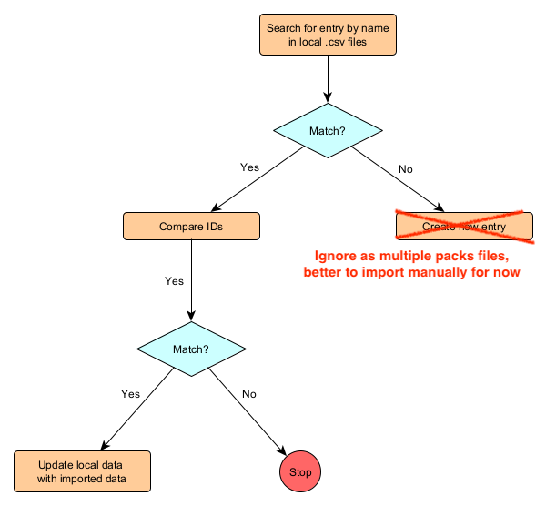

# Replace ID in packs

This scripts replaces item / entity ID on incoming compendiums with the old ID in the custom compendiums.



- If item on own compendium does not match item on incoming ==> Change item on incoming with old ID
- Item on own compendium doesn't exist on incoming ==> Add own item with own ID on incoming compendium
- New item on incoming compendium ==> Keep new item on incoming


## How to use

- Install `node` on your shell package manager

```sh
node -v
# There should be a version here
```

- Place two folders: `data/` and `packs/`.
  - - `/FoundryVTT/Data/systems/dnd5e/packs`
    - Compendium (Incoming)
    - kept in `*.db` files, line break separated JSON in 1 file
  - `/FoundryVTT/Data/worlds/{your_world_name}/data`
    - Own (with custom data)
    - kept in `*.db` files, line break separated JSON in 1 file


```sh
# packs -> folder containing compendium data files
# data -> folder containing world data
sh run.sh packs/ data/
```